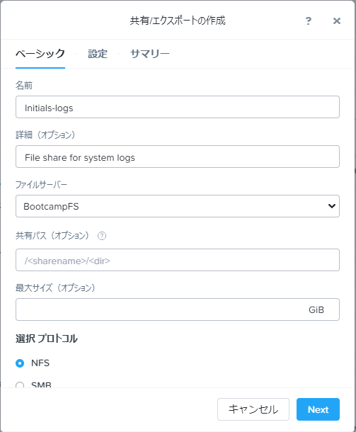

.. title:: Files

--------------------------------
ファイルとストレージの統合
--------------------------------

*このラボの所要想定時間は45分です。*

従来のファイルストレージはサイロ化した伝統的構造をしています。 例えばSANストレージのように技術的な進歩を欠いたり、拡張性に難があったりと、我々を悩ませてきました。
Nutanixではエンタープライズクラウドにこのようなサイロ状態はあってはならないと考えています。
仮想基盤として実績のあるHCI上のソフトウェアで実行可能なアプリケーションの様にファイルストレージを実装することで、
Nutanix Filesは高性能で、スケーラビリティのある迅速なイノベーションをワンクリックで管理可能にします。

**このラボでは、Filesを使ってSMB共有とNFSサーバの管理を体験していただき、File Analyticsを用いたFilesの新たなる機能性を探りましょう。**

今回は時間短縮のためのため、共有リソースの各クラスタ上にFilesクラスタが構築済みです。
**BootcampFS** はシングルノードで展開されていますが、通常 **Flies** の展開は3台のFile Server VMで開始し、パフォーマンスの必要に応じてスケールアップやスケールアウトすることが出来ます。

**BootcampFS** は、プライマリネットワークを使用してバックエンドストレージと通信し、CVM からボリュームグループへの iSCSI 接続を行い、セカンダリネットワークを使用してクライアント、Active Directory、アンチウィルスサービスなどと通信するように設定されています。

.. figure:: images/1.png

   .. note::

  本番環境では、一般的にクライアントとストレージ トラフィックのために専用の仮想ネットワークを使用して Files を配置することが望ましいとされています。2つのネットワークを使用する場合、Filesは設計上、クライアントトラフィックがストレージネットワークにアクセスできないようにします。

FilesはデータストレージにNutanixボリュームグループを利用しているため、圧縮、消去コーディング、スナップショット、レプリケーションなど、同じ基本的なストレージの利点を利用することができます。

#. **Prism Element > ファイルサーバー(File Server)** と進み、 **BootcampFS** を選択し **Protect** をクリックします。

   .. figure:: images/10.png

   デフォルトのSelf Service RestoreスケジュールがWindowsの前バージョンのスナップショットスケジュールを機能的に制御します。
   Windowsの以前のバージョン機能をサポートすることで、エンドユーザーはストレージ管理者やバックアップ管理者を介さずにファイルへの変更をロールバックすることができます。
   これらのローカルスナップショットは、ファイルサーバクラスタをローカルの障害から保護するものではなく、ファイルサーバクラスタ全体のレプリケーションをリモートのNutanixクラスタに実行することができることに注意してください。

SMB共有の管理
+++++++++++++++++++

このエクササイズではSMB共有の構築と管理を行います。SMB共有は、非構造化ファイルデータを共有する混成チームなどによるFiestaアプリケーションの開発をサポートするために使用されます。

共有の作成
..................

#. **Prism Element > ファイルサーバー(File Server)** と進み（先の手順で開いている場合は継続します）、  **+ Share/Export** をクリックします。

#. 以下のフィールドに入力します。

   - **名前(Name)** - *Initials\* -FiestaShare
   - **詳細(オプション)(Description (Optional))** - Fiesta app team share, used by PM, ENG, and MKT
   - **ファイルサーバー(File Server)** - **BootcampFS**
   - **共有パス(オプション) Share Path (Optional)** - Leave blank. This field allows you to specify an existing path in which to create the nested share.
   - **最大サイズ(オプション) Max Size (Optional)** - 200GiB
   - **選択プロトコル (Select Protocol)** - SMB

   .. figure:: images/2.png

   今回はシングルノード、つまりシングルのFSVMによる標準共有で全てまかないます。
   標準共有とは、すべてのルートディレクトリとファイルがシングルのFSVMで提供される状態です。

   これが3ノードのFSVMクラスタ以上であれば、分散共有を作成するオプションがあります。
   分散共有は、ホームディレクトリやユーザープロファイル、アプリケーションフォルダを共有するのに適しています。
   このタイプの共有では、ルートディレクトリ及びファイルへの要求をすべてのFSVMから行うことが可能で、接続に対してロードバランシングが可能です。

#. **Next** をクリックします。

#. **アクセスベース列挙法(ABE)を有効化(Enable Access Based Enumeration)** と **セルフサービスリストアを有効にする(Self Service Restore)** そして **Blocked File Types** に チェックを入れ、.flv,.mov を入力します。

   .. figure:: images/3.png

  .. note::
    **Access Based Enumeration (ABE)**
      特定のユーザーが読み取りアクセス権を持つファイルとフォルダーのみがそのユーザーに表示する機能です。 これは通常、Windowsファイル共有で有効です。

    **Self Service Restore**
      Windowsの以前のバージョン機能をから、Nutanixスナップショットに基づいて個々のファイルを以前のリビジョンに簡単に復元可能な機能です。

    **Blocked File Types**
      特定のタイプのファイル（大容量の個人用メディアファイルなど）を企業の共有に書き込まないように制限する機能です。
      また、これはサーバ毎もしくは、共有グループ毎に設定でき、サーバ全体のルールよりも優先して適応されます。

#. **Next** をクリックします。

#. **サマリー(Summary)** を確認し **作成(Create)** をクリックします。

   .. figure:: images/4.png

   多くの人が利用する共有では、リソースの公平な使用を確保するためにクォータを活用するのが一般的です。
   Filesは、Active Directory内の個々のユーザー、または特定のActive Directoryセキュリティグループのいずれかに対して
   共有ごとにソフトクォータまたはハードクォータを設定する機能を提供します。

#. **Prism Element > ファイルサーバー(File Server) > Share/Export(画面左側のボタン)** と進み、 あなたが作成した共有を選択し **+ Add Quota Policy** をクリックします。

#. 以下のフィールドに入力し、**Save** をクリックします。

  - Select **グループ(Group)**
  - **ユーザーまたはグループ(User or Group)** - SSP Developers
  - **割当(Quota)** - 10 GiB
  - **実施タイプ(Enforcement Type)** - ハードリミット(Hard Limit)

   .. figure:: images/9.png

共有のテスト
.................

#.  **Prism Element > 仮想マシン(VM)** と進み、*Initials*\ **-WinTools** を選択、画面下部の **Launch Console** をクリックし、コンソールを開きます。

以下のユーザを使用し、ログインします。既にログインされている場合はAdministratorであるため、一度サインアウトし再度サインインします。
   - **user** user *Initials*
   - **Password** nutanix/4u

   .. figure:: images/16.png

     Windows Tools VMは既に **NTNXLAB.local** ドメインに参加しています。

     .. note::
        **NTNXLABのadministratorアカウント以外** を使用します。
        これらのアカウントを使用してはRDP経由で接続することはできません。

#. **エクスプローラー** で ``\\BootcampFS.ntnxlab.local\`` を開きます.

#.  *Initials*\ **-WinTools** のブラウザーで以下にアクセスサンプルファイルをダウンロードします。
Indexページが有効になっているため、http://<IPアドレス>/ まで入力してリンクを辿ることも可能です。

   - **If using a PHX cluster** - http://10.42.194.11/workshop_staging/peer/SampleData_Small.zip
   - **If using a RTP cluster** - http://10.55.251.38/workshop_staging/peer/SampleData_Small.zip

#. ダウンロードしたzipファイルを展開しエクスプローラーで `\\BootcampFS.ntnxlab.local\*Initials*\ -FiestaShare`` にコピーします。

   .. figure:: images/5.png

   - **NTNXLAB\\Administrator** ユーザーは、ファイルクラスターの展開中にファイル管理者として指定され、デフォルトですべての共有への読み取り/書き込みアクセス権を付与されています。
   - 他のユーザーのアクセス管理は、他のSMB共有と同じ手法で管理することが出来ます。

..   #.  ``\\BootcampFS.ntnxlab.local\``, の *Initials*\ **-FiestaShare を右クリックし、プロパティを開きます **

#. **セキュリティ** タブの **詳細** を選択します.

      .. figure:: images/6.png

#. **Users (BootcampFS\\Users)** を選択し、**Remove** をクリックします。

#. **Add** をクリックします。

#. **プリンシパルを選択** を選択し、**オブジェクト名** のフィールドに **Everyone** を入力し、**OK** をクリックします。

      .. figure:: images/7.png

#. 下記フィールドを入力し **OK** をクリックします。:

      - **Type** - Allow
      - **Applies to** - This folder only
      - Select **Read & execute**
      - Select **List folder contents**
      - Select **Read**
      - Select **Write**

      .. figure:: images/8.png

#. **OK > OK > OK** とクリックし、変更を保存します。

   これで、すべてのユーザーが *Initials*\ **-FiestaShare** 共有内にフォルダーとファイルを作成できるようになります。

#. **PowerShell** を開き、以下のコマンドを使ってブロックされたファイルタイプのファイルを作成を試みます。

   .. code-block:: PowerShell

      New-Item \\BootcampFS\INITIALS-FiestaShare\MyFile.flv

   新しいファイルの作成が拒否されたことを確認します。

   .. figure:: images/25.png

#. **Prism Element > ファイルサーバー(File Server) > Share/Export** を開き、作成した共有を選択します。
画面下部で使用状況(Usage)やパフォーマンス(Performanceタブを見て共有毎の詳細情報を確認します(ファイル数や接続数、ストレージ使用率、レイテンシ、スループット、IOPSなど)。

   .. figure:: images/11.png

  次の演習では、ファイルを使用して各ファイルサーバーと共有の使用状況をさらに詳しく分析する方法を説明します。

File Analytics
++++++++++++++

この演習では新機能 “File Analytics” を見てみましょう。これは既存の共有をスキャンし、異常アラートを作成します。また、スキャン結果の詳細も確認できます。
File Analyticsは、Prism Elementの自動化されたワンクリック操作により、スタンドアロンVMとして数分でデプロイされます。
このVMは、あなたの環境に既にデプロイされ、有効化されています。

#. **Prism Element > ファイルサーバー(File Server) > File Server(画面左側のボタン)** と進み、 **BootcampFS** を選択した状態で、画面中段の **ファイル分析(File Analytics)** をクリックします。

   .. figure:: images/12.png

   .. note ::

      File Analyticsはすでに有効になっております。Enable File Analytics画面が表示された場合は
      すべての共有をスキャンするため以下認証情報を入力します。

      - **Username**: NTNXLAB\\administrator
      - **Password**: nutanix/4u

      .. figure:: images/old13.png

#. これは共有環境であるため、ダッシュボードには他のユーザーが作成した共有のデータがすでに表示されている可能性があります。 新しく作成した共有をスキャンするには、:fa:`gear` **> Scan File System** をクリックします。
   作成した共有を選択し、**Scan** をクリックします

   .. figure:: images/14.png

   .. note ::

      共有が表示されない場合は、1，2分お待ち頂き **Scan Files System** をクリックししてください。

#. **Scan File System** ウィンドウの右上の **×** をクリックし閉じて、File Analyticsを開いているブラウザーを更新します。

#. Scan結果を基にダッシュボードパネルが更新されます。

   .. figure:: images/15.png

#. *Initials*\ **-WinTools** VMから **SampleData** の下にあるいくつかのファイルを開いて、監査証跡アクティビティを作成します。

   .. note::
　ファイルを開く際に、OpenOfficeのウィザードが表示された場合は、次へを押して完了させます。

#. **Dashboard** ページを更新し、**Top 5 Active Users** , **Top 5 Accessed Files** そして **File Operations** パネルを確認します。

   .. figure:: images/17.png

#. ユーザーアカウントの監査証跡にアクセスするには、**Top 5 Active Users** でユーザーをクリックします。

#. または、ツールバーから **Audit Trails** を選択して、ユーザーまたは特定のファイルを検索することもできます。

   .. figure:: images/17b.png

   .. figure:: images/18.png

   .. note::

      例えば、**.doc** など、ワイルドカードを使った検索も可能です。

..
NFSを使ったエクスポート
+++++++++++++++++

この演習では、アプリケーションのサポートデータやログなどのアプリケーションデータや　Linux クライアントから一般的に作成される の構造化されていないファイルデータをNFSv4経由でエクスポートする方法を説明します。

NFSプロトコルの有効化
.....................

.. note ::

   NFSプロトコルの有効化は、Filesサーバごとに一度だけ行います。
   本環境ではFilesサーバーを共有で使用しているため、既に有効になっている場合があります。
   NFSが既に有効になっている場合は、`ユーザマッピングの設定` に進みます。

#. **Prism Element > ファイルサーバー(File Server)** と進み、**BootcampFS** を選択、画面中段右の **プロトコル管理(Protocol Management)** をクリックし、 **ディレクトリサービス(Directory Services)** をクリックします。

   .. figure:: images/29.png

#. **NFSプロトコルの使用(Use NFS Protocol)** にチェックを入れ、**ユーザー管理と認証(User Management and Authentication)** で、デデフォルトの **未管理(Unmanaged)** であることを確認し **更新(Update)** をクリックします。

   .. figure:: images/30.png

エクスポートの作成
...................

#. **Prism Element > ファイルサーバー(File Server)** と進み、 **+ Share/Export** をクリックします。

#. 次のフィールドに入力します。

   - **名前(Name)** - *Initials*\ **-logs**
   - **説明(オプション) (Description (Optional))** - File share for system logs
   - **ファイルサーバー (File Server)** - **BootcampFS**
   - **共有パス(オプション) (Share Path (Optional))** - 空白(Leave blank)
   - **最大サイズ(オプション) (Max Size (Optional))** - 空白(Leave blank)
   - **選択プロトコル (Select Protocol)** - NFS

#. **Next** をクリックします。

#. 次のフィールドを選択、入力します。

   - **セルフサービスリストアを有効にする(Enable Self Service Restore)** にチェックを入れます。
      - .snapshot ディレクトリが作成されます。
   - **Authentication(認証)** - システムSystem) デフォルト値のまま
   - **デフォルトアクセス(全クライアント対象) (Default Access (For All Clients))** - アクセス権なし(No Access)
   - **+ Add例外()+ Add exceptions)** をクリックし、
   - **読み書きアクセス権があるクライアント(Clients with Read-Write Access)** - 本演習環境クラスターの第三億テッドまでと\* を入力します
   例えば、Prism ElementのIPアドレスが、10.38.1.37の場合は10.38.1.\*  と入力

   .. figure:: images/fileslog02.png

デフォルトでは、NFSエクスポートは、エクスポートをマウントしているすべてのホストへの読み書きアクセスを許可しますが、今回のシナリオでは特定のIP範囲に読み書き制限をしています。

#. **Next** をクリックします。

#. **Summary** を確認し **作成(Create)** をクリックします。

エクスポートのテスト
..................

#. **Prism Element > 仮想マシン(VM)** と進み、画面右側にある、**search in table** に *Initials*\ を入力し表示をフィルターします。

#. *Initials*\ **-NFS-Client** VM を選択し **Power on** をクリックします。既に電源オンの場合次の手順に進みます。

#. *Initials*\ **-NFS-Client** VMをクリックし、 IP Addressesの項目から IPアドレスを確認し、次の認証情報を使用してSSH経由で接続します。

   - **ユーザー名** - root
   - **パスワード** - nutanix/4u

#. 以下を実行します。

     .. code-block:: bash

       [root@CentOS ~]# yum install -y nfs-utils #This installs the NFSv4 client
       [root@CentOS ~]# mkdir /filesmnt
       [root@CentOS ~]# mount.nfs4 BootcampFS.ntnxlab.local:/ /filesmnt/
       [root@CentOS ~]# df -kh
       Filesystem                      Size  Used Avail Use% Mounted on
       /dev/mapper/centos_centos-root  8.5G  1.7G  6.8G  20% /
       devtmpfs                        1.9G     0  1.9G   0% /dev
       tmpfs                           1.9G     0  1.9G   0% /dev/shm
       tmpfs                           1.9G   17M  1.9G   1% /run
       tmpfs                           1.9G     0  1.9G   0% /sys/fs/cgroup
       /dev/sda1                       494M  141M  353M  29% /boot
       tmpfs                           377M     0  377M   0% /run/user/0
       iBootcampFS..ntnxlab.local:/             1.0T  7.0M  1.0T   1% /filesmnt
       [root@CentOS ~]# ls -l /filesmnt/
       total 1
       drwxrwxrwx. 2 root root 2 Mar  9 18:53 *Initials*\ -logs

#. 実行結果から ``/filesmnt/*Initials*\ -logs``のように、ディレクトリがマウントされたことを確認します。

#. VMを再起動するとマウントが外れるため、起動時にマウントするように以下のコマンドを実行し ``/etc/fstab`` に追記します。

     .. code-block:: bash

       echo 'BootcampFS.ntnxlab.local:/ /filesmnt nfs4' >> /etc/fstab

#. 以下のコマンドを実行し、``/filesmnt/logs`` ディレクトリに2MBのランダムデータを100個作成します。

     .. code-block:: bash

       mkdir /filesmnt/*Initials*\ -logs/host1
       for i in {1..100}; do dd if=/dev/urandom bs=8k count=256 of=/filesmnt/*Initials*\ -logs/host1/file$i; done

#. **Prism Element> ファイルサーバー(File Server) > Share/Export > *Initials*\ -logs** にを選択し、パフォーマンスと使用状況を監視します。

   使用率のデータは10分毎の更新であることに注意してください。

マルチプロトコル共有
+++++++++++++++++++++

Nutanix Files は、SMB 共有と NFS エクスポートの両方を別々にプロビジョニングする機能を提供しますが、同じ共有にマルチプロトコルアクセスを提供する機能もサポートしています。

ユーザーマッピングの構成
.......................

Nutanixファイル共有には、ネイティブプロトコルと非ネイティブプロトコルの概念があります。
すべてのパーミッションはネイティブプロトコルを使用して適用されます。
非ネイティブプロトコルを使用したアクセス要求は、ネイティブ側から適用されたパーミッションへのユーザーまたはグループのマッピングを必要とします。
ユーザーとグループのマッピングを適用するには、ルールベースのマッピング、明示的なマッピング、デフォルトのマッピングなど、いくつかの方法があります。

最初にデフォルトのマッピングを設定します。

#. **Prism Element > ファイルサーバー(File Server) > File Server(画面左側のボタン)**  と進み、 **BootcampFS** を選択し、 **プロトコル管理(Protocol Management) を選択、 ユーザーマッピング(User Mapping)** をクリックします。

#. デフォルト設定のまま **Next** を2回クリックし **デフォルトのマッピング(Default Mapping)** ページに進みます。

#. **デフォルトのマッピング(Default Mapping)** ページにて **NFSエクスポートへのアクセス拒否(Deny access to NFS export)** と **SMB共有へのアクセスを拒否する(Deny access to SMB share)** を指定します。既に設定されている場合は次の項目へ進みます。

   .. figure:: images/31.png

#.  サマリー画面で **Save** をクリックし、デフォルトマッピングの設定を完了します。完了後、**閉じる(close)** をクリックしします。

#. **Prism Element > ファイルサーバー(File Server) > Share/Export(画面左側のボタン)** と進み、 *Initials*\ **-FiestaShare** を選択し、画面中段右の **Update** をクリックします。

#. **ベーシック(Basics)** ページ下部の **ネイティブではないNFSアクセスも有効化します** にチェックを入れ **Next** をクリックします。

   .. figure:: images/32.png

#.  **設定ページの下部、マルチプロトコルアクセス(Multiprotocol Access)** にて、 **両方のプロトコルから同じファイルへの同時アクセス(Simultaneous access to the same files from both protocols)** にチェックを入れます。

   .. figure:: images/33.png

#. **Next > 保存(Save)** とクリックし、共有設定の更新を完了します。

エクスポートのテスト
.......................

#. NFSエクスポートをテストするために、SSH経由で *Initials*\ **-LinuxToolsVM** VM にアクセスします。

   - **ユーザー名** - root
   - **パスワード** - nutanix/4u

#. 次のコマンドを実行します。

     .. code-block:: bash

       [root@CentOS ~]# yum install -y nfs-utils #This installs the NFSv4 client
       [root@CentOS ~]# mkdir /filesmulti
       [root@CentOS ~]# mount.nfs4 bootcampfs.ntnxlab.local:/<Initials>-FiestaShare /filesmulti
       [root@CentOS ~]# dir /filesmulti
       dir: cannot open directory /filesmulti: Permission denied
       [root@CentOS ~]#

   .. note:: コマンド操作では、大文字と小文字が区別されます。

デフォルトのマッピングではアクセスを拒否するように設定されているため、Permission denied エラーが発生することが予想されます。
ここで、非ネイティブのNFSプロトコルユーザーへのアクセスを許可するための明示的なマッピングを追加します。
明示的なマッピングを作成するには、ユーザーID（UID）を取得する必要があります。

#. 次のコマンドを実行して、UIDをメモします。

     .. code-block:: bash

       [root@CentOS ~]# id
       uid=0(root) gid=0(root) groups=0(root)
       [root@CentOS ~]#

#. **Prism Element > ファイルサーバー(File Server) > File Server(画面左側のボタン)**  と進み、 **BootcampFS** を選択し、 **プロトコル管理(Protocol Management)** を選択、 **ユーザーマッピング(User Mapping)** をクリックします。

#. **Next** をクリックし **明示的なマッピング(Explicit Mapping)** まで進みます。

#. **1対1のマッピングリスト(One-to-onemapping list)** で **手動で追加** をクリックします。

#.  次のフィールドに入力します。

   - **SMB名(SMB Name)** - NTNXLAB\devuser *Initials*\
   - **NFS ID** - UID from previous step (0 if root)
   - **User/Group** - ユーザー(User)

   .. figure:: images/34.png

#. **アクション(Actions)** の **保存(Save)** をクリックします。

#. **Next > Next > Save** とクリックし、ユーザーマッピングを更新します。

#. *Initials*\ **-LinuxTools VM** に戻り、共有に再度アクセスを試みます。

     .. code-block:: bash

       [root@CentOS ~]# dir /filesmulti
       Sample\ Data
       [root@CentOS ~]#

#. SSHセッションでテキストファイルを作成し、Windowsクライアントからファイルにアクセス出来ることを確認します。

.. code-block:: bash

  [root@CentOS ~]# touch /filesmulti/memo.txt

まとめ
+++++++++

**Nutanix Files** について、

- Filesは既存のNutanixクラスタ上に迅速に展開でき、SMBやNFS環境を構築することができます。
- Filesは局所的なソリューションではありません。 VM、Files、Block、Objectストレージ、これらを同じプラットフォームで提供でき、複雑さや管理がサイロ化するリスクを軽減できます。また、最適なスケールアップやスケールアウトをワンクリックで提供できます。
- File Analyticsはデータがどの様に組織で使用されているのかを明確にし、それらを管理する助けになります。 それはデータへのアクセスを最小限に抑え、セキュリティ・コンプライアンスの要件を満たすのにも一役買います。
